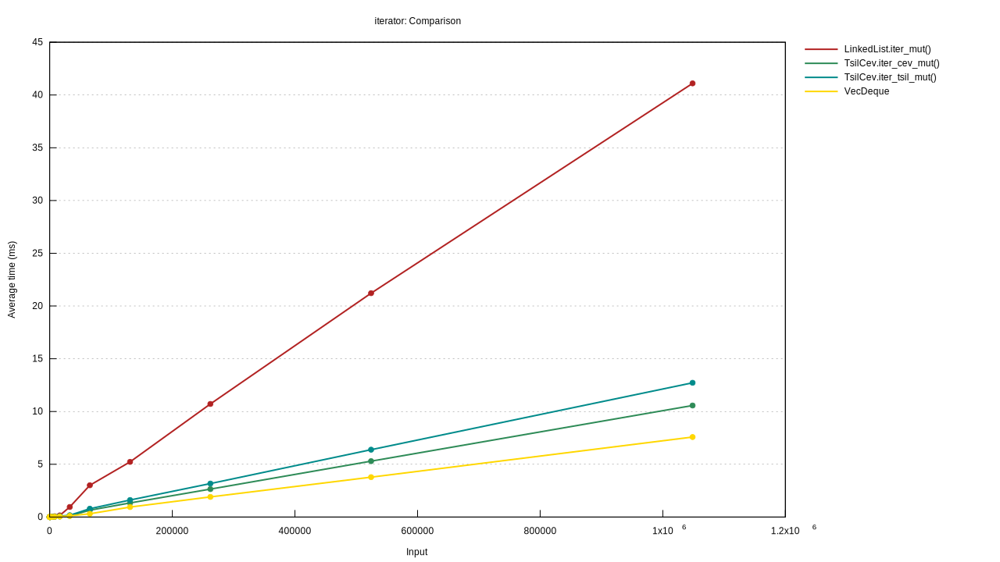
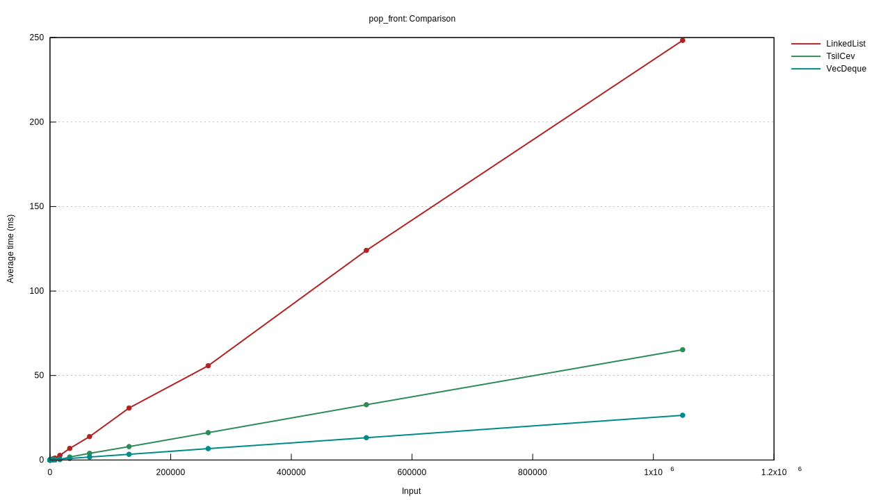
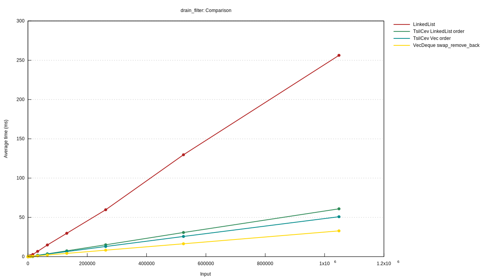
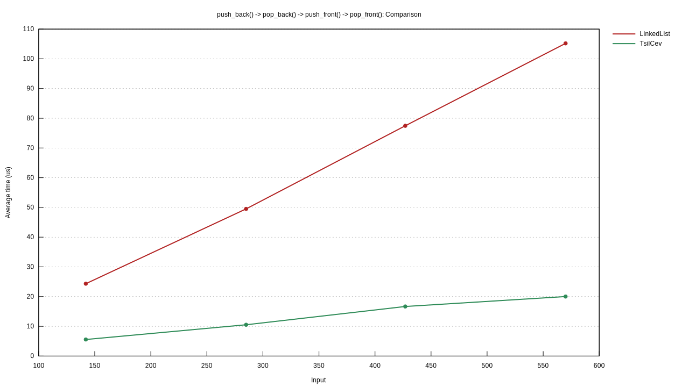

# TsilCev


[](LICENSE)

`LinkedList` on `Vec`. Add and remove O(1) amortized. It has a similar interface to `LinkedList` and similar to `Vec`.

## Example

```rust
use tsil_cev::TsilCev;

let mut tc = TsilCev::from(vec![5, 6, 7, 8, 9, 10]);
tc.push_front(4);

let mut cursor = tc.cursor_front_mut();
assert_eq!(cursor.current(), Some(&4));

cursor.move_next();
assert_eq!(cursor.current(), Some(&5));

cursor.remove();
assert_eq!(cursor.current(), Some(&6));

cursor.remove().remove().move_next_length(2);
assert_eq!(cursor.current(), Some(&10));

cursor.move_prev();
assert_eq!(cursor.current(), Some(&9));

let _ = tc.drain_filter_tsil(|x| *x % 2 == 0).collect::<Vec<_>>();
assert_eq!(tc.to_vec(), &[9]);
```

# Comparison with `LinkedList` *(thank [Criterion](https://github.com/bheisler/criterion.rs))*




